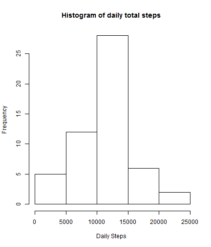
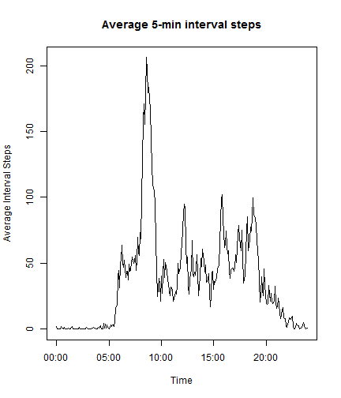
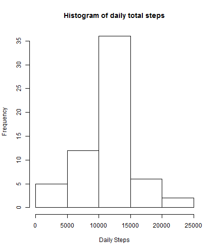
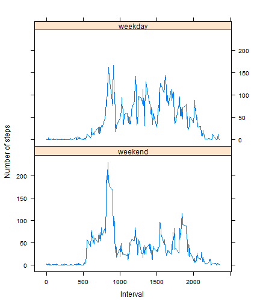

### Remember to test for and load required packages

```r
if (!require(lattice)) {
      install.packages("lattice")
      library(lattice)
}
if (!require(plyr)){
      install.packages("plyr")
      library(plyr)
}
```

## Loading and preprocessing the data
Data has been downloaded from the following url:

[https://d396qusza40orc.cloudfront.net/repdata%2Fdata%2Factivity.zip](https://d396qusza40orc.cloudfront.net/repdata%2Fdata%2Factivity.zip)

The zip archive was unpacked and the data file **activity.csv**  moved to the working directory (repo). Then it loaded with the **read.csv()** function:


```r
## Load activity data
activity <- read.csv("activity.csv", header=T, na.strings="NA", sep=",")
```

No pre-processing was necessary. 

## What is mean total number of steps taken per day?
- First the total number of steps taken every day was calculated, using **tapply()** and the **sum** function, grouped by the date variable: 

```r
dailySteps <- tapply(activity$steps, activity$date, sum)
```

Here is the histogram of the daily steps:

```r
hist(dailySteps, main="Histogram of daily total steps", xlab="Daily Steps")
```

 

The mean and median of the daily steps are now calculated and reported:

```r
## calculate mean and median of the daily steps
meanSteps <- mean(dailySteps, na.rm=T)
medianSteps <- median(dailySteps, na.rm=T)

print(paste("Mean daily steps = ", meanSteps))
```

```
## [1] "Mean daily steps =  10766.1886792453"
```

```r
print (paste("Medial of the daily steps = ", medianSteps))
```

```
## [1] "Medial of the daily steps =  10765"
```

## What is the average daily activity pattern?
To calculate the average number of steps during 5-minute intervals across all days, the **tapply()** function is used again, this time with the **mean()** function, removing missing values with na.rm=T

```r
averageIntervalSteps <- tapply(activity$steps, activity$interval, mean, na.rm=T)
```

To plot the x-axis properly, first generate a time series of 5-minute intervals for the x axis

```r
timeAxis <-seq.POSIXt(from=strptime("00:00", format="%H:%M"), by="5 min",
            along.with=averageIntervalSteps)
```

Then use the series for the x-axis in the **plot():**

```r
plot(timeAxis,averageIntervalSteps,type="l",
     main="Average 5-min interval steps",
     xlab="Time", ylab="Average Interval Steps")
```

 

To determine the time interval with the maximum average, find the maximum average, then the index of that in the averages and extract the corresponding time. By default, the POSIX sequence generated for the time axis includes "today" as the date component. So use **substr()** to extract the time-only portion.


```r
maxAveSteps <- max(averageIntervalSteps)
idxMax <- match(maxAveSteps,averageIntervalSteps)
maxTime <- timeAxis[idxMax]
sprintf("The maximum number of steps on average is %f, and it occurs at %s",
      maxAveSteps, substr(maxTime,12,16))
```

```
## [1] "The maximum number of steps on average is 206.169811, and it occurs at 08:35"
```

## Imputing missing values
Find the number of missing values as complement of complete cases **!complete.cases():**


```r
missingValues <- nrow(activity[!complete.cases(activity),])
print(paste("Number of missing values (rows with NAs) = ", missingValues))
```

```
## [1] "Number of missing values (rows with NAs) =  2304"
```

To impute missing values, use average of steps for same 5-minute interval over all days


```r
numIntervals <- nrow(averageIntervalSteps)
newActivity <- activity
for (i in 1:nrow(newActivity)){
      if (is.na(newActivity[i,1])){
            rowIdx <- i %% numIntervals
            if (rowIdx == 0) rowIdx =  numIntervals
            newActivity[i,1] <- averageIntervalSteps[rowIdx]
      }
}
```

To plot the new histogram, first calculate the new daily sums:


```r
newDailySum <- tapply(newActivity$steps, newActivity$date, sum)
```

The histogram is here:


```r
hist(newDailySum, main="Histogram of daily total steps", xlab="Daily Steps")
```

 

### What is the effect of the imputation on the mean and median?

```r
newMeanSteps <- mean(newDailySum, na.rm=T)
newMedianSteps <- median(newDailySum, na.rm=T)

if (meanSteps == newMeanSteps){
      print(paste("Mean daily steps remain the same: ", newMeanSteps))
} else {
      sprintf("Imputing missing values changes daily steps from %f to %f", 
              meanSteps,newMeanSteps)
}
```

```
## [1] "Mean daily steps remain the same:  10766.1886792453"
```

```r
if (medianSteps == newMedianSteps){
      print(paste("Median of daily steps remain the same: ", medianSteps))
} else {
      sprintf("Imputing missing values changes median of daily steps from %f to %f", 
              medianSteps,newMedianSteps)
}
```

```
## [1] "Imputing missing values changes median of daily steps from 10765.000000 to 10766.188679"
```

## Are there differences in activity patterns between weekdays and weekends?
Add the new weekday variable


```r
newActivity$weekday <- ifelse(weekdays(as.POSIXct(newActivity$date)) %in% 
            c("Saturday",  "Sunday"),"weekend", "weekday")
newActivity$weekday <- factor(newActivity$weekday, labels=c("weekend", "weekday"))

newAverage <- ddply(newActivity, .(interval, weekday), 
      summarize, averageSteps=mean(steps))
```

The lattice plot is most suitable to produce a plot similar to the example.


```r
p <- xyplot(averageSteps ~ interval | weekday, type="l", data=newAverage,
            xlab="Interval", ylab="Number of steps", layout=c(1,2))
print (p)
```

 

The plots show a discernible difference in activity patterns between weekends and weekdays.This is supported by the summary statistics:


```r
tapply(newAverage$averageSteps, newAverage$weekday, summary)
```

```
## $weekend
##    Min. 1st Qu.  Median    Mean 3rd Qu.    Max. 
##    0.00    2.25   25.80   35.60   50.90  230.00 
## 
## $weekday
##    Min. 1st Qu.  Median    Mean 3rd Qu.    Max. 
##    0.00    1.24   32.30   42.40   74.70  167.00
```

